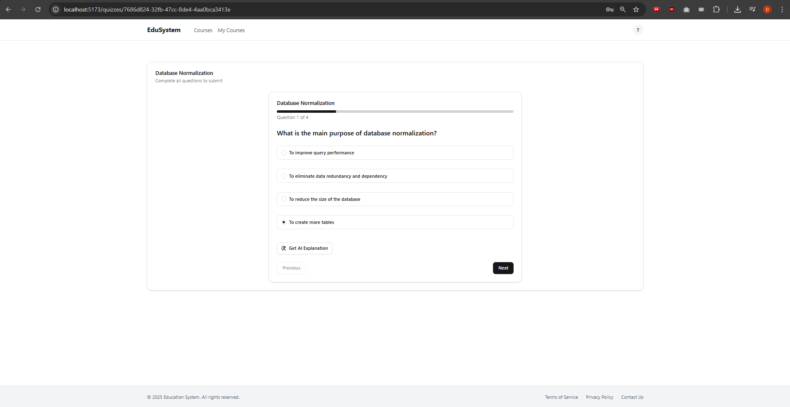
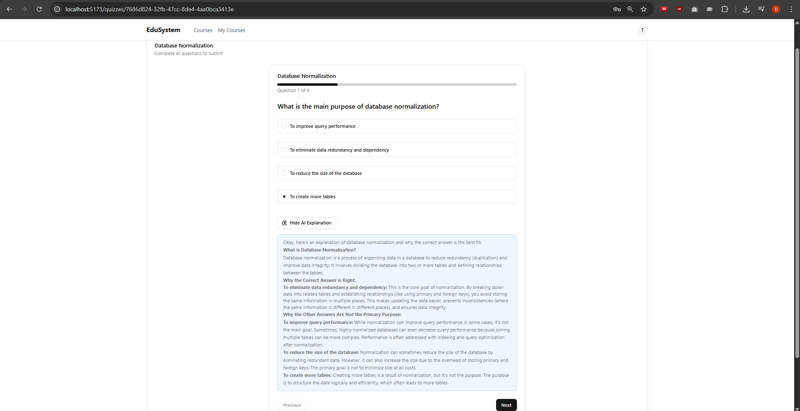

---

## 🚀 Getting Started (EduSystem: Frontend + Backend)

Follow these steps to run the app locally:

---

### 🔧 Backend Setup (ASP.NET Core)

1. **Clone the repository**
   *(If you haven't already)*

   ```bash
   git clone https://github.com/Genchovski2708/edusystem-uiktp.git
   ```

2. **Navigate to the backend project folder**

   ```bash
   cd edusystem-uiktp/backend
   ```

3. **Set up the database**
   Run the following command to apply EF Core migrations and create the database:

   ```bash
   dotnet ef database update
   ```

4. **Run the backend server**

   ```bash
   dotnet run
   ```

   The backend will typically run at:
   **[http://localhost:5182/](http://localhost:5182/)**
   Do not close the window. The app is used through frontend url, not backend.

> ⚠️ Make sure you have the [.NET 6+ SDK](https://dotnet.microsoft.com/download) installed.

---

### 💻 Frontend Setup (Vite + React)

1. **Navigate to the frontend folder**

   ```bash
   cd ../frontend
   ```

2. **Install dependencies**

   ```bash
   npm install
   ```

3. **Add your API Key**
   Create a `.env` file in the **root** of the frontend project:

   ```env
   VITE_GEMINI_API_KEY=your-api-key-here
   ```

   You can get your free API Key from Google AI Studio:
   👉 [https://aistudio.google.com/apikey](https://aistudio.google.com/apikey)

4. **Start the development server**

   ```bash
   npm run dev
   ```

   The app will be running at:
   **[http://localhost:5173](http://localhost:5173)**

---

## 🧠 AI Quiz In Action

Here’s a quick look at the core AI feature in use:

**Quiz UI**


**AI-Powered Explanation**


---
